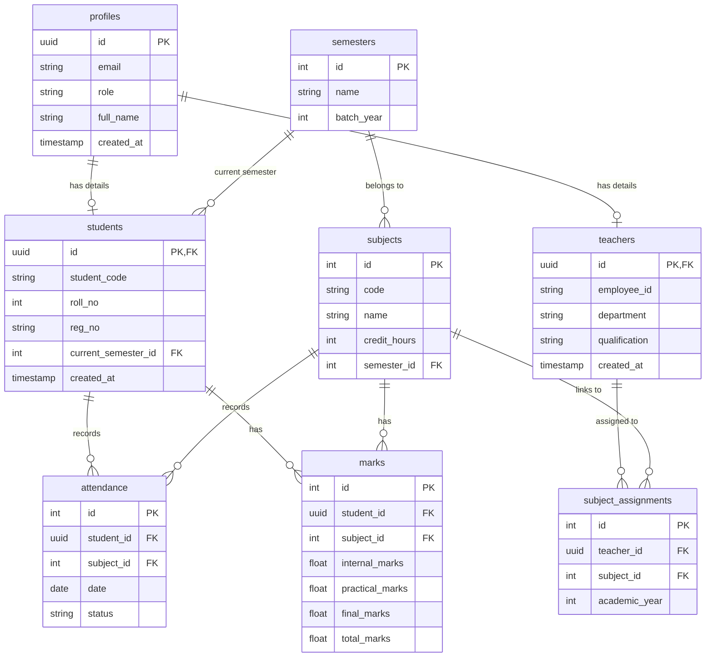

# Database Schema Overview

This document provides a visual representation of the relationships between the tables in our system.

```mermaid
erDiagram
    profiles ||--o| students : "has details"
    profiles ||--o| teachers : "has details"
    semesters ||--o{ subjects : "belongs to"
    semesters ||--o{ students : "current semester"
    teachers ||--o{ subject_assignments : "assigned to"
    subjects ||--o{ subject_assignments : "links to"
    students ||--o{ attendance : "records"
    subjects ||--o{ attendance : "records"
    students ||--o{ marks : "has"
    subjects ||--o{ marks : "has"

    profiles {
        uuid id PK
        string email
        string role
        string full_name
        timestamp created_at
    }

    students {
        uuid id PK, FK
        string student_code
        int roll_no
        string reg_no
        int current_semester_id FK
        timestamp created_at
    }

    teachers {
        uuid id PK, FK
        string employee_id
        string department
        string qualification
        timestamp created_at
    }

    semesters {
        int id PK
        string name
        int batch_year
    }

    subjects {
        int id PK
        string code
        string name
        int credit_hours
        int semester_id FK
    }

    subject_assignments {
        int id PK
        uuid teacher_id FK
        int subject_id FK
        int academic_year
    }

    attendance {
        int id PK
        uuid student_id FK
        int subject_id FK
        date date
        string status
    }

    marks {
        int id PK
        uuid student_id FK
        int subject_id FK
        float internal_marks
        float practical_marks
        float final_marks
        float total_marks
    }
```
